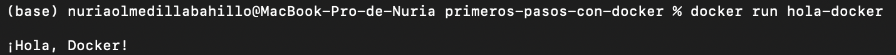

# Primeros-pasos-con-docker

Este proyecto demuestra cómo construir una imagen Docker básica para ejecutar un programa Python.

## Construcción de la imagen

A continuación, se muestra la salida del comando `docker build`:

## Ejecución del contenedor

La salida del comando `docker run` fue la siguiente:

